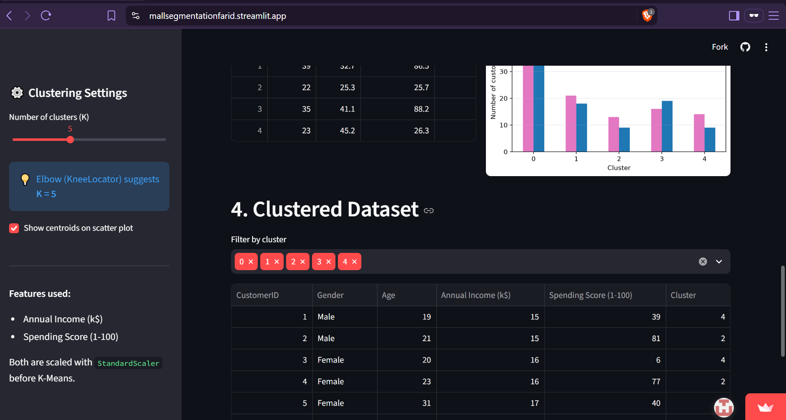

# Mall Customer Segmentation & Streamlit Application

## Overview

An end-to-end unsupervised learning project that groups mall customers into segments with **K-Means clustering** and presents the results in an interactive **Streamlit** web application. Users can inspect the dataset, study the Elbow Method chart, choose the number of clusters with a slider, and see the clusters update instantly.

## Dataset

- **File:** `data/Mall_Customers.csv`
- **Total samples:** 200 customers
- **Columns:**

| Column | Description |
|--------|-------------|
| CustomerID | Unique ID assigned to each customer |
| Gender | Gender of the customer |
| Age | Age of the customer |
| Annual Income (k$) | Annual income in thousands of dollars |
| Spending Score (1-100) | Score assigned based on spending behavior |

- **Clustering features:**
  - Annual Income (k$)
  - Spending Score (1-100)

## Method

1. Scale the clustering features with `StandardScaler`.
2. Compare K = 2 to 10 using the Elbow Method.
3. Run K-Means (`random_state=42`) using the K selected in the Streamlit app.
4. Visualize the resulting customer clusters.

### Feature Scaling
K-Means groups points by distance, so a feature with a larger range would dominate the result. `StandardScaler` transforms each feature to mean 0 and standard deviation 1, giving income and spending score equal weight. The original values are kept for the plots and tables so they stay readable.

### K-Means
K-Means splits the data into K clusters. It places K centroids, assigns every customer to the nearest centroid, moves each centroid to the mean of its assigned customers, and repeats until the assignments stop changing. Cluster IDs (0, 1, 2, ...) are arbitrary labels, not a ranking.

### Elbow Method
Inertia is the sum of squared distances from each point to its cluster centroid. It always decreases as K grows, but at some point the improvement slows down. The "elbow" of the inertia-vs-K curve marks a good balance between simplicity and fit. For this dataset, the elbow is at **K = 5**.

## Application Features

- Dataset overview: rows, columns, missing values, preview, summary statistics
- Elbow Method chart with the selected K highlighted
- K slider (2 to 10) that reruns K-Means automatically
- Scatter plot of income vs spending score colored by cluster
- **Extras:** automatic K suggestion (KneeLocator), centroids on the scatter plot, silhouette score, cluster profile table, gender distribution per cluster, cluster filter, and CSV download of the clustered data

## Streamlit Application

**Live App:** https://your-app-name.streamlit.app

### Screenshot



## Installation

```bash
git clone https://github.com/yourusername/mall-customer-segmentation.git
cd mall-customer-segmentation
pip install -r requirements.txt
```

## Usage

```bash
streamlit run app.py
```

The app opens at http://localhost:8501.

## Project Structure

```
mall-customer-segmentation/
├── data/
│   └── Mall_Customers.csv
├── app.py
├── screenshots/
│   └── streamlit_app.png
├── README.md
└── requirements.txt
```

## Technologies Used

- Python
- Pandas
- Matplotlib
- Scikit-learn
- Streamlit
- Kneed
